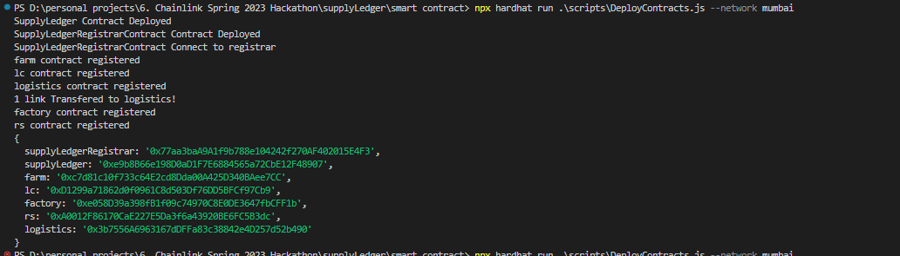
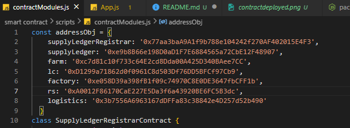
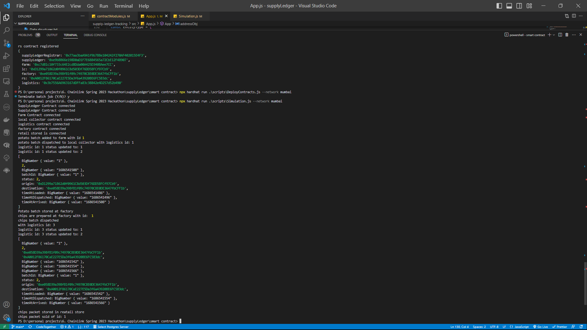

# SupplyLedger

SupplyLedger is a Secure, Transparent, and Reliable Supply Chain Management System for tracking the journey of potato chips from harvest to the end consumer. It leverages blockchain technology and real-time logistics tracking to provide users with detailed information about the chips' origins, processing, and distribution.

## Features

- **Transparent Tracking**: Customers can track the entire supply chain journey of their chips packet, from the farm to the retail store.
- **Immutable Records**: All supply chain data is stored on the blockchain, ensuring transparency and tamper-proof records.
- **Real-time Logistics**: Integrated with Chainlink to provide real-time tracking of shipment status using external APIs.
- **Webd Interface**: A web-based interface that allows users to easily access and view supply chain details.
- **Double Spending Prevention**: Implemented required conditions to prevent double spending and ensure the integrity of transactions.
- **Maximum Capacity Control**: Added maximum capacity limits for all entities involved in the supply chain to prevent them from storing more than their capacity allows.

## Technologies Used

- Solidity: Smart contract development language for Ethereum blockchain.
- Hardhat: Ethereum development environment for compiling, testing, and deploying smart contracts.
- ReactJS: JavaScript library for building user interfaces.
- Tailwind CSS: Utility-first CSS framework for styling the frontend.
- Chainlink: Decentralized oracle network for accessing real-world data.

# Depolyed Contracts and Frontend

## Smart Contracts : deployed on polygon mumbai testnet

```js
    supplyLedgerRegistrar: '0x77aa3baA9A1f9b788e104242f270AF402015E4F3',
    supplyLedger: '0xe9b8B66e198D0aD1F7E6884565a72CbE12F48907',
    farm: '0xc7d81c10f733c64E2cd8Dda00A425D340BAee7CC',
    lc: '0xD1299a71862d0f0961C8d503Df76DD5BFCf97Cb9',
    factory: '0xe058D39a398fB1f09c74970C8E0DE3647fbCFF1b',
    rs: '0xA0012F86170CaE227E5Da3f6a43920BE6FC5B3dc',
    logistics: '0x3b7556A6963167dDFFa83c38842e4D257d52b490'
```

### Frontend - [SupplyLederWebsite](https://supply-ledger.vercel.app/)
https://supply-ledger.vercel.app/


# Installation and Testing

### - Running Smart Contracts Simulation

To run the SupplyLedger project locally, follow these steps:

- Clone the repository: `git clone https://github.com/abhithory/supplyLedger.git`
- Go to smart contract directory: `cd '.\supplyLedger\smart contract\`
- Install dependencies: `cd '.\supplyLedger\smart contract\`
- make env file and store privatekeys of your wallect:

```js
PRIVATE_KEY1=
PRIVATE_KEY2=
PRIVATE_KEY3=
PRIVATE_KEY4=
PRIVATE_KEY5=
PRIVATE_KEY6=
```

## For Testing locally

- use ganache for local blockchain. and `put its accounts private key in hardhat config files`
- go to logistics smart contract and change the "updateShipmentStatus" function: `update this this`

```js
   function updateShipmentStatus(
        uint256 _shipmentId,
        uint256 _status
    ) public onlyRegistrar {
        require(_shipmentId <= shipmentId, "Invalid shipment ID");

        if (_status == 1) {
            shipmentOf[_shipmentId].timeAtDispatched = block.timestamp;
            shipmentOf[_shipmentId].status = ShipmentStatus.InTransit;
            CommonEntity _entity = CommonEntity(
                shipmentOf[_shipmentId].destination
            );
            _entity.receivedFromLogistic(
                shipmentOf[_shipmentId].batchId,
                _shipmentId
            );
        } else if (_status == 2) {
            // ===================== for api testing with chainlink. comment this while local testing
            // requestUpdateStaus(_shipmentId);

            // ===================== for local testing. comment this while while testing on api calls with chainlink

            shipmentOf[_shipmentId].status = ShipmentStatus(2);
            shipmentOf[_shipmentId].timeAtArrived = block.timestamp;
        } else {
            require(false, "status is wrong");
        }
    }
```

- then for testing all smartcontracts: `npx hardhat test`
- now for running simulation first run deploy contract script: `npx hardhat run .\scripts\DeployContracts.js --network ganache`
- also you can run on diffrent networks: `npx hardhat run .\scripts\DeployContracts.js --network ganache`
- after that copy the address of contracts and paste them in `scripts/contractModules.js --network ganache`

## 



- Now after pasting contract address run simulate script: `npx hardhat run .\scripts\Simulation.js --network ganache`

- after runnning scipt you will see the entire supply chain steps and finally you will get a `chipspacketid`
- now you can use that `chipspacketid` to track all details of that chips packet
- you can use `TrackDetailsOfChipsPacket.js` scipt or frontend for tracking

## For Testing on Polygon Mumbai Testnet

- use polygon mumbai testnet and `put its 6 wallet private key in env file`. Each wallet should have some matic tokens for transaction and admin wallet should have chainlink token also
- go to logistics smart contract and change the "updateShipmentStatus" function: `update this this`

```js
   function updateShipmentStatus(
        uint256 _shipmentId,
        uint256 _status
    ) public onlyRegistrar {
        require(_shipmentId <= shipmentId, "Invalid shipment ID");

        if (_status == 1) {
            shipmentOf[_shipmentId].timeAtDispatched = block.timestamp;
            shipmentOf[_shipmentId].status = ShipmentStatus.InTransit;
            CommonEntity _entity = CommonEntity(
                shipmentOf[_shipmentId].destination
            );
            _entity.receivedFromLogistic(
                shipmentOf[_shipmentId].batchId,
                _shipmentId
            );
        } else if (_status == 2) {
            // ===================== for api testing with chainlink. comment this while local testing
             requestUpdateStaus(_shipmentId);

            // ===================== for local testing. comment this while while testing on api calls with chainlink

            // shipmentOf[_shipmentId].status = ShipmentStatus(2);
            // shipmentOf[_shipmentId].timeAtArrived = block.timestamp;
        } else {
            require(false, "status is wrong");
        }
    }
```

- testing will not work for all function because in logistic we are using chainlink that is not possible in local
- now for running simulation first run deploy contract script: `npx hardhat run .\scripts\DeployContracts.js --network mumbiai`
- also you can run on diffrent networks: `npx hardhat run .\scripts\DeployContracts.js --network mumbai`
- after that copy the address of contracts and paste them in `scripts/contractModules.js --network mumbai`
- Now after pasting contract address run simulate script: `npx hardhat run .\scripts\Simulation.js --network mumbai`



- after runnning scipt you will see the entire supply chain steps and finally you will get a `chipspacketid`
- now you can use that `chipspacketid` to track all details of that chips packet
- you can use `TrackDetailsOfChipsPacket.js` scipt or frontend for tracking

## Inspiration

- The inspiration behind SupplyLedger stemmed from the need to address the existing challenges in supply chain management. We recognized the lack of transparency and traceability in the supply chain, which led to consumer concerns regarding product quality, sustainability, and ethical practices. We were inspired to create a solution that would revolutionize supply chain management, bringing transparency, security, and reliability to the process. For example when we buy potato chips packet so we don't they were is came from? when it was created? from what type of potato it created? so for solving all these problem we have created this supplychain management system.

## What it does

- SupplyLedger is a comprehensive supply chain management system specifically designed for the potato chips industry. It leverages blockchain technology to securely store and track the entire supply chain journey, from the farm where the potatoes are harvested to the factory where they are processed into chips. Customers can access this information through a user-friendly frontend and track the details of their chips packet, including farm location, quality standards, processing details, and logistics information. also it uses chainlink to call external apis to update the shipment status of logistics. User can see all details of chips packet and their potato from which it was preapared.

## How we built it

- We built SupplyLedger using a combination of technologies. On the backend, we utilized Solidity, a programming language for writing smart contracts on the Ethereum blockchain, within the Hardhat development environment. This allowed us to create secure and immutable records of the supply chain data. For the frontend, we used ReactJS and Tailwind CSS to develop a visually appealing and user-friendly interface for customers to interact with the system. We also integrated Chainlink's real-time tracking solutions to provide accurate and up-to-date logistics information.

## Challenges we ran into

- During the development process, we encountered several challenges. One of the key challenges was integrating external APIs for real-time logistics tracking. We had to ensure seamless integration and reliability of the data provided by these APIs. Additionally, ensuring the security and integrity of the blockchain infrastructure required careful attention to detail and thorough testing. Overcoming these challenges required a combination of technical expertise, problem-solving skills, and effective collaboration among team members.

## Accomplishments that we're proud of

- In these smart contract we have created condition for maximum capacity and checking these batch of potato and chips is very important that that we proud the most. We are proud to have created a comprehensive supply chain management system that brings transparency and trust to the potato chips industry. Our accomplishment lies in successfully implementing blockchain technology to securely store and track the supply chain data. Furthermore, integrating Chainlink's real-time tracking solutions was a significant achievement, enhancing the accuracy and reliability of logistics information.

## What we learned

- I have learned a lot about supply chain management. I have read about this and then implement it in smart contract. so by this way I learned many things about development and also about supplychain management. Throughout the development of SupplyLedger, we gained invaluable knowledge and experience. We deepened our understanding of blockchain technology and its applications in supply chain management. We learned about the complexities of integrating external APIs and ensuring data integrity. Collaboration and effective communication were vital in overcoming challenges and achieving our goals.

## What's next for SupplyLedger

- Looking ahead, our vision for SupplyLedger is to expand its application beyond the potato chips industry. We aim to adapt and customize the system to cater to other product lines and industries. We will continue to enhance the user experience, incorporating user feedback and implementing new features to meet evolving market needs. Additionally, we plan to explore partnerships with stakeholders across the supply chain to further improve transparency and sustainability. Our journey with SupplyLedger is ongoing, and we are excited to drive the future of supply chain management toward a more transparent and customer-centric paradigm.There are a lot more features remained we can add them in these smart contracts
